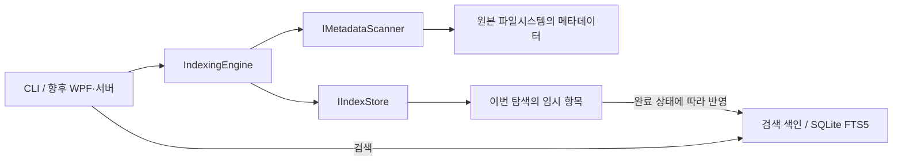

# 색인·검색 엔진 설계

## 목표와 현재 범위

우선순위는 불필요한 디스크 접근 감소, 탐색 부하 조절, 검색 속도입니다. 검색은 SQLite 색인만 읽고, 원본 탐색은 사용자가 요청한 작업으로 분리합니다. 현재 범위는 메타데이터 탐색·수동 갱신과 비용이 큰 범위의 보류·요청 시 탐색입니다. 변경 알림·저널을 이용한 자동 증분 갱신은 다음 단계입니다.

`IMetadataScanner`는 DB를 몰라도 메타데이터 배치를 전달할 수 있습니다. `IIndexStore`는 수집 결과의 임시 저장·반영과 검색을 담당합니다. `IndexingEngine`은 탐색 범위와 DB 위치를 검증하고 쓰기 작업을 직렬화합니다. UI와 서버는 이 조합을 호출하므로 탐색 알고리즘을 다시 구현할 필요가 없습니다.

`RefreshPlanner`는 호스트가 전달한 변경 폴더 경로에서 불필요한 갱신 작업을 제거합니다. 계획 단계는 파일 존재 여부나 디렉터리 목록을 조회하지 않습니다.

## 탐색 시간을 줄이는 방법

### 1. 시작 범위를 작게 정하고 하위 구조를 가지치기

확실한 첫 색인을 만들려면 포함할 항목을 실제로 관찰해야 합니다. 제외 규칙 수가 고정되어 있다면 목록을 읽는 기본 작업은 관찰한 항목 수 `N`에 대해 `O(N)`입니다. 알고리즘만으로 읽지 않은 구조의 파일 이름을 알 수는 없습니다. 따라서 드라이브 전체 대신 업무 데이터 루트를 선택하고, 제외 폴더는 내부 목록을 열기 전에 건너뜁니다. 이 복잡도는 DB 저장·색인 생성과 네트워크 대기까지 상수 시간으로 처리한다는 의미는 아닙니다.

현재 제외 규칙은 다음과 같습니다.

| 규칙 | 적용 | 줄어드는 작업 |
|---|---|---|
| 폴더 이름 | 모든 깊이에서 정확히 같은 폴더 이름 제외 | 해당 폴더와 하위 구조 탐색·색인 |
| 폴더 이름 Regex | 이름 전체(`full`) 또는 부분(`partial`) 정규식 일치 | 해당 폴더와 하위 구조 탐색·색인 |
| 경로 | 해당 경로 및 하위 구조 제외 | 해당 범위 탐색·색인 |
| 파일 패턴 | 파일 이름의 `*`, `?` 패턴 제외 | 해당 파일의 색인 생성·DB 저장 |

파일 패턴은 부모 폴더의 목록을 읽은 뒤 판단합니다. 따라서 `*.tmp`만 제외하는 것보다 임시 파일이 모여 있는 폴더를 제외하는 편이 탐색 시간을 더 크게 줄일 수 있습니다. 숨김·시스템 속성은 자동으로 제외하지 않습니다. 어떤 항목이 불필요한지는 저장소마다 다르기 때문입니다.

`ScanOptions.ExcludedDirectoryNameRegexes`는 `Pattern`, `MatchMode`, 선택적 `IgnoreCase`를 받습니다. 기본 `Full`은 `\A(?:pattern)\z`로 전체 이름을 제한하고 `Partial`은 일반 Regex 매칭을 사용합니다. 기본 대소문자 정책은 호스트 경로와 같고 문화권에는 의존하지 않습니다. 컴파일 오류는 DB 초기화 전 검증에서 거부합니다. 매칭마다 100ms 제한을 사용하며 시간 초과는 파일시스템 부분 오류로 삼키지 않고 상위 엔진으로 전달하여 staging 전체를 버립니다. 기존 색인·pending·비용 이력은 보존됩니다.

`ExclusionMatcher`를 탐색기와 `RefreshPlanner`가 공유합니다. scoped refresh에서는 루트까지 조상을 확인하여 Regex도 우회할 수 없게 합니다. 제외 정책은 보류보다 먼저 적용하며 on-demand도 같은 제외 검사를 거칩니다. 이름별 매칭 결과를 무제한 캐시하지 않습니다.

CLI의 `--config`는 camelCase `ScanOptions` JSON을 읽으며, CLI 목록은 추가하고 명시한 수치 옵션은 덮어씁니다. 설정 파일의 상대 경로는 파일 위치 기준으로 해석합니다. 제외 정책과 진단 보고서는 DB에 새로 영속화하지 않으며 기존 schema 1 읽기·schema 2 이전 동작을 그대로 유지합니다.

`ScanReport.Diagnostics`는 해당 실행에서 관찰한 제외 경로와 사유, 사유별·종류별 건수, 반복 폴더 이름과 횟수·최대 3개 예시를 제공합니다. 경로 상세와 추적할 이름 종류에는 각각 기본 1,000개·4,096종의 상한이 있으며 생략 건수도 반환합니다. 같은 항목이 여러 규칙에 맞으면 경로·정확한 이름·Regex·파일 패턴 순으로 하나만 집계합니다. 제외·보류·링크 폴더도 부모에서 관찰했다면 이름 집계에 포함하지만 열지 않은 자손은 세지 않습니다. 이름별 개수는 추적 대상으로 선택된 이름에 대해서만 정확하며 전체 트리의 상위 순위를 보장하지 않습니다. 이 집계는 추가 파일시스템 조회를 하지 않습니다.

### 2. 파일별 추가 조회를 줄이는 디렉터리 열거

`System.IO.Enumeration.FileSystemEnumerable<T>`로 폴더를 하나씩 열거합니다. Windows에서는 이름·속성·크기·날짜를 디렉터리 열거 결과에서 가져와 파일마다 `FileInfo`를 만들고 별도로 메타데이터를 요청하는 작업을 줄입니다. 파일 내용과 해시는 읽지 않습니다. 다른 OS에서는 필요한 메타데이터에 따라 추가 시스템 호출이 발생할 수 있으므로 같은 I/O 특성을 가정하지 않습니다.

폴더는 재귀 열거에 모두 맡기지 않고, 직접 관리하는 프레임 스택으로 깊이 우선 탐색합니다. 제외 여부와 링크 여부를 확인한 후 다음 폴더를 엽니다. 열린 열거기 수와 경로 상태는 폭이 아니라 깊이에 따라 늘어납니다. 기본 순회의 스택·배치 메모리는 대략 `O(깊이 + 배치 크기)`입니다. 추가한 보류 목록과 비용 이력 힌트, 폴더별 열거 버퍼, SQLite 캐시·임시 저장 공간·검색 결과의 메모리와 디스크 비용은 별도로 고려해야 합니다.

깊이 우선 탐색이 HDD에서 항상 가장 빠른 순서인 것은 아닙니다. 실제 파일 배치와 서버 캐시를 알 수 없기 때문입니다. 여기서는 큰 폴더 목록 전체를 메모리에 쌓지 않고, 한 번에 한 경로를 탐색하여 부하를 예측하기 쉽게 만드는 효과를 우선합니다.

심볼릭 링크·Windows 정션 등 reparse point는 따라가지 않습니다. 순환 탐색과 외부 범위 진입을 줄이는 동시에, 링크 뒤의 데이터가 검색에서 빠지는 명확한 절충이 있습니다. 필요한 실제 대상은 별도 루트로 설정하는 편이 좋습니다.

### 3. 탐색을 몰아서 실행하지 않기

현재 기본값은 다음과 같습니다.

| 항목 | 기본값 | 의미 |
|---|---|---|
| 항목 처리율 | 약 2,000개/초 | 제외한 파일도 관찰 비용이 있으므로 계산에 포함 |
| 폴더 대기 | 진입 전 5ms | 작은 폴더를 연속으로 여는 속도 조절 |
| 배치 크기 | 256개 | DB에 한 항목씩 저장하는 반복 비용 감소 |
| 최대 탐색 깊이 | 256 | 과도하게 깊은 구조 제한. 도달 시 부분 완료로 보고 |
| 기록할 상세 오류 | 최대 100개 | 오류 폭증 시 메모리 제한. 전체 오류 수는 별도로 유지 |
| 열거 버퍼 | 16KiB | 디렉터리 목록을 받는 버퍼. 실제 디스크 요청량을 직접 규정하지 않음 |

배치 저장은 전체 탐색 결과를 메모리에 보관하지 않고 저장소로 넘깁니다. 색인 쓰기와 원본 읽기가 경쟁하지 않도록 DB를 원본 밖의 로컬 SSD에 두는 것을 권합니다.

CLI에서는 처리율과 폴더 대기 시간을 조정할 수 있습니다. 배치·깊이·오류·버퍼 설정은 현재 엔진의 `ScanOptions`에서 지정합니다.

처리율은 OS가 반환한 항목에 대한 대략적인 제한입니다. OS·SMB의 선행 읽기와 캐시 때문에 하드웨어 IOPS, 대역폭, 순간 요청량을 엄격하게 제한하는 기능은 아닙니다. 빨리 끝내는 설정과 낮은 순간 부하는 서로 충돌할 수 있으므로 실제 장비에서 시간과 부하를 함께 측정해야 합니다.

### 4. 필요한 하위 폴더만 갱신하기

`ScopePath` 또는 CLI의 `--scope`로 루트 내부의 하위 폴더만 다시 읽을 수 있습니다. 다른 폴더의 기존 색인은 유지합니다. 예를 들어 새 프로젝트 자료가 `Projects/Alpha`에 들어왔다는 사실을 알고 있다면 다른 프로젝트와 문서를 다시 읽지 않습니다.

현재 CLI에서는 사용자가 갱신 범위를 지정합니다. 변경을 자동으로 찾아내는 기능은 아직 없으며, 폴더의 수정 시간이 같다는 이유로 하위 파일을 건너뛰지도 않습니다. 중첩된 파일 내용의 수정이 모든 상위 폴더 날짜에 반영되는 것은 아니므로, 이 판단으로 정확성을 보장할 수 없습니다.

### 5. 변경 작업을 합친 뒤 탐색하기

`RefreshPlanner.Plan(root, dirtyDirectoryPaths, options)`는 변경되어 재검증이 필요한 **폴더 경로**를 받아 다음 순서로 정리합니다.

1. 루트 내부의 경로인지 검증하고 제외된 폴더·하위 경로를 제거합니다.
2. 같은 폴더의 중복 경로를 하나로 합칩니다.
3. 부모 폴더가 이미 포함되어 있으면 그 아래 폴더의 별도 작업을 제거합니다.
4. 남은 범위를 일정한 순서의 `ScanRequest` 목록으로 반환합니다.

예를 들어 같은 폴더에서 100개 파일이 수정되어 같은 폴더 경로가 100번 들어오면 탐색 요청은 하나입니다. `Projects/Alpha`와 그 아래 `Projects/Alpha/Reports`가 들어오면 `Alpha` 요청만 남습니다. 입력한 부모 폴더가 없는 서로 다른 형제 폴더는 독립 범위로 유지하며, 임의로 더 큰 루트를 재탐색하지 않습니다.

경로 집합의 부모를 해시 집합에서 확인하므로 모든 경로 쌍을 비교하는 방식을 피합니다. 입력 폴더 수 `n`, 최대 깊이 `d`, 결과 범위 수 `k`에 대해 예상 해시 조회·정렬 비교 횟수는 `O(n × d + k log k)`입니다. 문자열 정규화·해시·비교 비용은 경로 길이에 따라 추가됩니다. 계획기의 저장 공간은 제외 규칙 수 `e`를 포함해 `O(n + e)`입니다.

이 API는 파일 경로·알림 원문을 해석하거나 디스크를 감시하지 않습니다. 호출하는 프로그램이 변경 폴더 목록과 제한된 크기의 대기열을 관리하고, 누락된 변경을 재검증해야 합니다. CLI는 현재 이 계획기에 자동으로 이벤트를 전달하지 않으며 `--scope`로 직접 갱신합니다.

### 6. 비용이 큰 폴더를 예측·보류하고 요청 시 탐색하기

`ScanOptions.Deferral`의 `DeferralPolicy`는 기본으로 비활성입니다. 이름·경로 목록은 비어 있고, 항목 수·시간 기준과 작업 예산은 지정되지 않습니다. 사용자가 명시적으로 선택하면 다음 방식을 함께 사용할 수 있습니다.

| 방식 | 적용 시점 | 한계 |
|---|---|---|
| `DirectoryNames`, `Paths` | 폴더 내부로 들어가기 전 | 그 폴더 내용은 실제 탐색할 때까지 미확인 |
| `HistoricalEntryThreshold` | 정상 탐색 이력에서 하위 구조의 항목 수를 확인한 뒤 | 첫 탐색의 미지정 폴더 크기는 예측 불가 |
| `HistoricalDurationThreshold` | 정상 탐색 이력의 소요 시간을 확인한 뒤 | 장비·서버 부하가 달라지면 시간도 달라짐 |
| `EntryBudget`, `TimeBudget` | 이번 탐색 작업이 예산에 도달한 뒤 | 진행 중인 동기 OS 호출은 끝날 때까지 중단 불가 |

예측에는 정상적으로 완료한 개별 폴더·하위 구조의 항목 수와 소요 시간을 사용합니다. 이력을 DB에 보관하므로 프로그램을 다시 시작해도 활용할 수 있습니다. 임계값과 같거나 큰 이력 후보가 보류 대상이며, 이번 작업의 이력 힌트 조회는 최대 4,096개로 제한합니다. 후보 한도를 넘으면 일부 폴더에 이력 기반 보류가 적용되지 않을 수 있습니다. 확실히 보류할 범위는 이름·경로 규칙으로 지정합니다.

시간은 속도 제한·폴더 대기·DB 처리 지연까지 포함하는 관찰값이며, 순수 HDD 탐색 시간은 아닙니다. 처리율 설정을 높였다면 이전의 낮은 처리율에서 측정한 이력은 실제보다 느리게 예측할 수 있습니다. 항목 수를 세기 위한 별도의 선행 탐색은 수행하지 않습니다. 루트 전체가 크다는 이력만으로 루트 전체를 보류하여 작은 하위 폴더의 탐색까지 막지는 않습니다.

예산은 매 파일의 OS 요청을 강제로 중단하는 기능이 아닙니다. 네이티브 호출이 반환된 경계에서 확인하고, 이번 탐색 범위 전체를 보류로 기록합니다. 한 번의 SMB 호출이 오래 멈춰 있으면 시간 예산을 넘길 수 있습니다. 따라서 이력과 예산은 부하 조절을 돕는 수단이며 정확한 완료 시간 보장이 아닙니다.

`MaxPendingScopes`의 기본값은 256개입니다. 보류 목록이 이 제한을 넘으려 하면 개별 경로들을 현재 탐색 범위 하나로 합쳐 메모리 사용을 제한합니다. 예산이나 이 제한 때문에 전체 범위를 보류하면 이미 완료한 가지도 미확인 범위 표시 아래에 포함되고, 해당 가지의 과거 미관찰 항목을 보수적으로 보존할 수 있습니다.

영구 제외와 보류는 구분합니다. 제외는 사용자가 검색 대상에서 뺀 범위이고, 보류는 미확인 상태를 유지하며 나중에 탐색할 범위입니다. 보류 내부의 과거 검색 항목은 삭제하지 않으며 처음 보는 파일을 안다고 가정하지 않습니다. `ScanReport.PendingScopes`와 `ListPendingAsync`로 경로·이유·추정 비용을 확인할 수 있습니다.

`ScanRequest.OnDemand = true`는 보류 규칙과 예산을 우회하고 선택한 범위의 현재 상태를 처음부터 탐색합니다. 영구 제외, 처리율, 링크 검사와 취소는 그대로 적용하며 저장된 열거 커서에서 이어가는 방식은 아닙니다. 기존 요청에 `with { OnDemand = true }`를 적용하면 같은 `Options`가 유지됩니다. CLI는 정책을 DB에 저장하지 않으므로 같은 `--config`와 추가 제외 옵션을 다시 전달해야 합니다.

하위 폴더 하나를 탐색했다고 보류된 부모 전체의 상태가 해소되지는 않습니다. 부모의 보류를 해소하려면 그 범위 전체의 정상 탐색이 필요합니다. 그전에는 이미 확인한 하위 항목의 `CoveragePending`도 보수적으로 유지될 수 있습니다. 보류된 폴더가 삭제되었다면 부모나 전체 루트의 정상 탐색에서 부재를 확인한 뒤 보류 상태를 정리합니다.

검색은 항상 저장된 색인만 조회합니다. `SearchResult.HasPendingScopes`는 검색 결과가 0개여도 미확인 범위가 있음을 표시하고, `IndexedEntry.CoveragePending`은 반환된 항목이 보류 범위와 연결됨을 표시합니다. 검색 입력 자체가 탐색 작업을 실행하지 않습니다. WPF에서 사용자 요청을 받아 실행하거나 서버에서 작업을 예약하는 호스트는 아직 구현하지 않았습니다.

## 불필요한 탐색을 줄이는 구체적인 예

| 상황 | 설정·운영 예 | 확인할 점 |
|---|---|---|
| 업무 데이터만 필요 | 드라이브 전체 대신 `D:\Shared\Documents`, `D:\Shared\Projects`를 루트로 선택 | 루트 밖 자료는 검색되지 않음 |
| 캐시·빌드 결과가 매우 큼 | 실제 정책에 따라 `cache`, `bin`, `obj`, `node_modules` 폴더 이름 제외 | 같은 이름의 업무 폴더까지 빠질 수 있음. 특정 경로 제외가 더 안전할 수 있음 |
| 장비의 임시 작업 공간 | `D:\Shared\Temp` 경로와 하위 전체 제외 | 임시 공간에 중요한 작업 파일이 보관되는지 먼저 확인 |
| 오래된 보관 자료가 거의 변하지 않음 | 처음에는 색인하고, 변경이 많은 작업 폴더만 자주 `--scope` 갱신 | 보관 자료도 이동·삭제될 수 있으므로 별도 재검증 주기 필요 |
| 보관 자료가 많아 최초 탐색도 오래 걸림 | `Archive`를 `--defer-dir`로 보류하고 필요할 때 해당 범위를 `--on-demand` 탐색 | 탐색 전의 새 내용은 검색되지 않으며 미확인 상태 표시 필요 |
| 원격 작업 폴더의 응답이 느림 | `RemoteWork`를 경로로 보류하거나 정상 탐색의 시간 이력 기준 적용 | 이력 시간은 순수 디스크 시간과 다르며 다음 작업 시간 보장 없음 |
| 처음 보는 대형 폴더 | 작업 항목·시간 예산을 정해 보류 상태로 남기고 범위를 선택해 후속 탐색 | 목록을 읽기 전 전체 항목 수를 알 수 없고 진행 중인 SMB 호출은 즉시 중단 불가 |
| 같은 공유 폴더가 링크로 여러 번 등장 | 링크를 따라가지 않고 실제 대상 하나만 루트로 사용 | 서로 다른 UNC 별칭의 물리적 중복까지 자동으로 판단하지는 않음 |
| 임시 파일이 여러 업무 폴더에 흩어짐 | `*.tmp`, `~$*` 등 파일 패턴 제외 | 색인 크기는 줄지만 폴더 열거 비용은 남음 |
| 여러 사용자가 검색 | 중앙 색인 하나를 검색 API로 제공 | 사용자별 원본 파일 접근 권한과 검색 결과 노출 정책이 필요 |
| 이름·날짜 검색만 필요 | 내용 색인·해시 계산을 하지 않음 | 본문 검색과 내용 중복 검사는 지원 범위 밖 |

제외 정책은 명시적으로 선택합니다. 예시의 폴더·패턴이 자동 기본값이라는 뜻은 아닙니다. 새로 제외한 폴더 자체의 기존 색인까지 정리하려면 그 부모 범위 또는 전체 루트를 다시 탐색해야 합니다. 제외된 폴더 자체를 범위로 갱신하면 그 폴더의 기존 항목은 보존될 수 있습니다.

## 검색 알고리즘

원본을 검색 요청마다 열지 않고 SQLite에서 이름·경로·종류·크기·UTC 날짜를 조회합니다. 날짜·루트 조회에 일반 인덱스를 활용하고 종류 조건을 함께 적용합니다. 이름 부분일치는 FTS5 trigram 색인으로 후보를 좁힙니다.

Trigram은 이름을 연속된 3개 Unicode 코드 포인트 단위로 색인합니다. 예를 들어 `분기보고서`는 `분기보`, `기보고`, `보고서`를 검색 후보에 사용할 수 있습니다. 단어 단위 검색과 달리 이름 중간의 한글도 찾기 위한 선택입니다. 후보를 찾은 뒤 실제 이름에 검색 문자열이 들어가는지 확인하며, 사용자 입력은 SQL·FTS 연산자로 실행하지 않고 문자 그대로 처리합니다.

1~2개 코드 포인트의 검색어는 trigram 후보를 만들 수 없으므로 `INSTR` 기반 대체 경로를 사용합니다. 정확한 결과는 제공하지만 전체 후보를 살펴볼 수 있어 파일이 많을수록 비용이 커집니다. 짧은 검색어에는 루트·종류·날짜 조건을 함께 사용하고, 대규모 데이터에서 실측해야 합니다.

날짜는 UTC로 저장합니다. 범위는 `from <= 날짜 < before`이고 API·CLI 입력은 시간대를 명시해야 합니다. 생성일의 제공 여부와 의미·정밀도는 파일시스템 및 서버 구현에 따라 다를 수 있으며, 값이 실제 업무 문서 작성일과 같다고 가정하지 않습니다.

## 탐색 실패와 색인 일관성

전체 탐색 결과를 바로 기존 색인에 덮어쓰지 않습니다. 각 실행을 고유한 `ScanId`로 구분해 배치 결과를 staging 영역에 저장하고, 상태에 따라 DB 트랜잭션으로 반영합니다.

기존 항목과 메타데이터가 같은 경우 본 검색 색인의 업데이트를 생략합니다. 날짜·크기만 변경된 경우에도 이름의 검색용 값이 같으면 FTS 재생성을 생략합니다. 원본 열거와 staging 저장까지 생략하는 것은 아니지만 반복 탐색에서 불필요한 본 색인 쓰기를 줄입니다. 반영하기 전에는 저장된 staging 메타데이터의 경로·종류·날짜·크기도 검증합니다.

- **정상 완료:** 해당 루트·탐색 범위에서 새로 관찰한 항목을 반영하고, 해당 범위의 기존 항목 중 이번에 관찰하지 못한 항목을 제거합니다. 하위 폴더 갱신은 다른 범위에 영향을 주지 않습니다.
- **보류 범위 있음 (`Deferred`):** 확인한 항목과 보류 범위를 반영합니다. 보류 내부의 기존 항목을 보존하고, 정상 탐색한 비보류 범위에서만 미관찰 항목을 제거합니다.
- **부분 완료:** 권한 거부, SMB 연결 문제, 깊이 제한 등 오류가 있으면 확인한 항목만 추가·갱신합니다. 이번에 보지 못한 항목을 삭제하거나 기존 보류를 해소하지 않습니다.
- **취소:** 이번 staging 결과, 보류 범위와 비용 이력을 반영하지 않고 기존 검색 색인을 유지합니다.

전체 탐색의 루트 자체는 검색 항목이 아닙니다. 하위 폴더를 부분 갱신할 때는 범위 폴더 자체의 메타데이터도 한 번 조회해 추가·갱신합니다. 정상 완료의 미관찰 항목 삭제 대상은 범위의 엄격한 하위 항목으로 한정하므로, 범위 폴더를 열지 못했다는 이유로 그 폴더 자체의 기존 항목을 삭제하지 않습니다.

부분 완료에서 오래된 항목이 남는 것은 정보 유실보다 보존을 선택한 결과입니다. 오류 목록과 마지막 성공 시각을 향후 화면에 표시하고, 문제를 해결한 뒤 재검증해야 합니다. 작업 중에는 이전 색인을 검색할 수 있습니다.

DB 트랜잭션은 검색 색인을 한 번에 반영하지만 원본 파일시스템을 같은 시점에 고정하지는 않습니다. 사용자가 탐색 도중 생성·이동·삭제할 수 있으므로 최초 색인도 원본의 원자적 스냅샷은 아닙니다. 자동 변경 감지와 재검증은 이 차이를 복구하는 후속 기능입니다.

엔진은 DB 위치가 원본 내부인 경우 쓰기 전에 거부하며, 기존 설정 경로의 일반적인 링크·정션도 거부합니다. Windows 장치 네임스페이스 경로는 허용하지 않습니다. 원본은 일반 UNC 공유 경로를 사용할 수 있지만, DB의 UNC 경로와 네트워크 드라이브로 식별되는 위치는 거부합니다. 비 Windows 시스템의 네트워크 마운트는 모두 자동 식별하지 못하므로 로컬 DB 위치를 지정해야 합니다. DB가 기존의 다른 애플리케이션 데이터베이스라면 색인 저장소로 사용하지 않습니다. 이런 검사는 잘못된 설정을 줄이기 위한 것이며, 동시에 다른 프로세스가 링크를 바꾸는 공격이나 OS·하드웨어 고장을 막는 보장은 아닙니다.

## 변경 감지를 추가할 때의 기준

| 실행 위치 | 후속 후보 | 복구 방식 |
|---|---|---|
| Windows NTFS를 직접 관리하는 호스트 | USN 변경 저널 기반 provider | 저장한 저널 위치에서 재개. 저널 교체·기록 유실 시 재검증 |
| 로컬 FAT32 등 | `FileSystemWatcher`와 예약 재검증 | 알림 유실·중단 시 재탐색 |
| SMB 공유 폴더를 사용하는 클라이언트 | 서버가 지원하는 변경 알림과 재검증 | 연결 단절·버퍼 초과 후 재탐색 |

NTFS 저널은 해당 볼륨을 직접 접근할 수 있는 호스트에서 필요한 권한으로 사용합니다. NTFS 공유 폴더라는 사실만으로 원격 SMB 클라이언트가 USN을 읽을 수 있는 것은 아닙니다. 일반 변경 알림은 변경 이력 DB로 취급하지 않으며, 유실 시 복구 경로가 있어야 합니다.

변경 알림은 특정 항목의 최종 상태를 확인하거나 변경된 폴더를 갱신하는 계기로 사용합니다. 같은 폴더에 몰린 알림은 모아서 처리하고, 부모 범위에 포함되는 중복 작업은 합칠 수 있습니다. 파일 삭제와 일시적인 접근 실패는 구분해야 합니다. 사용자 검색 때마다 재탐색하지 않는 원칙은 유지합니다.

## 검증과 다음 단계

현재 검증 대상은 제외 폴더 가지치기, 제외된 상위 폴더 아래의 부분 갱신, 링크 우회 방지, 원본 내부 DB 거부, 탐색 후 원본 내용·날짜 보존, 검색어의 문자 그대로 처리, 한글의 짧은 부분일치, 날짜 경계, 페이지 조회입니다. 갱신 계획기의 중복·부모 범위 병합, 제외 규칙과 루트 경계도 검증합니다. 탐색 실패·취소 시 이전 색인의 보존과 하위 범위 갱신의 경계도 검증해야 합니다.

보류 기능은 명시적 규칙 적용 전 폴더 진입 방지, 비용 이력의 재시작 후 재사용, 예산 도달 시 이전 항목 보존, 결과가 비어도 남는 보류 표시, 요청 시 탐색의 영구 제외 유지, 하위 탐색 후 부모 보류 보존을 검증해야 합니다. 취소·부분 오류·보류 목록 제한의 보수적 처리와 이전 색인의 호환성도 확인 대상입니다.

| 단계 | 상태·목표 |
|---|---|
| 공통 엔진과 CLI | 메타데이터 탐색·검색·제외·수동 부분 갱신·갱신 범위 병합·보류·요청 시 탐색 구현 |
| 실제 Windows·SMB 검증 | 큰 폴더, 깊은 구조, 동시 이동·삭제, 권한 거부, 연결 단절, 취소 지연 확인 |
| 성능 측정 | 같은 데이터에서 최초 탐색·부분 갱신 시간, 디스크 읽기·대기 시간, DB 크기, 검색 지연 측정 |
| 변경 provider | 실행 위치에 따라 USN 또는 변경 알림 선택. 유실 탐지·복구·작업 병합 구현 |
| 실행 호스트 | WPF, 예약 작업, 중앙 서비스·API, 사용자별 검색 권한 구현 |

CI에는 Windows와 Ubuntu의 복원·빌드·테스트를 구성했습니다. 현재 클라우드 실행 환경은 Linux이며, 원격 CI 실행 결과를 확인한 것은 아닙니다.

이전 버전에서 생성한 엔진 소유의 색인도 읽기 전용 검색을 계속 지원합니다. 새 탐색을 시작할 때 기존 검색 항목을 보존하면서 보류·이력을 위한 저장 형식으로 업그레이드합니다.

성능 수치는 실제 장비에서 얻기 전에는 보장하지 않습니다. 최초 검증에서는 기본 제한과 더 낮은 제한을 비교하고, 폴더 제외 전후의 관찰 항목 수와 탐색 시간을 함께 기록합니다. 실제 Windows NTFS·SMB에서 검증하기 전의 다른 OS 테스트는 해당 플랫폼의 동작을 모두 증명하지 않습니다.

## 확인한 공식 자료

- [.NET Windows FileSystemEntry 구현](https://github.com/dotnet/runtime/blob/main/src/libraries/System.Private.CoreLib/src/System/IO/Enumeration/FileSystemEntry.Windows.cs): 디렉터리 열거 결과에서 파일 이름·크기·날짜를 사용하는 근거.
- [.NET EnumerationOptions 구현](https://github.com/dotnet/runtime/blob/main/src/libraries/System.Private.CoreLib/src/System/IO/EnumerationOptions.cs): 버퍼 크기 및 숨김·시스템 기본 제외 동작. 본 엔진은 속성에 따른 자동 제외를 해제합니다.
- [.NET Windows FileSystemEnumerator 구현](https://github.com/dotnet/runtime/blob/main/src/libraries/System.Private.CoreLib/src/System/IO/Enumeration/FileSystemEnumerator.Windows.cs): 내장 재귀 열거의 하위 폴더 핸들 처리와 직접 스택을 관리하는 방식의 차이.
- [Microsoft FSCTL_READ_USN_JOURNAL 문서](https://github.com/MicrosoftDocs/sdk-api/blob/docs/sdk-api-src/content/winioctl/ni-winioctl-fsctl_read_usn_journal.md): 변경 저널 읽기와 SMB 미지원 범위.
- [Microsoft ReadDirectoryChangesW 문서](https://github.com/MicrosoftDocs/sdk-api/blob/docs/sdk-api-src/content/winbase/nf-winbase-readdirectorychangesw.md): 변경 알림 버퍼 초과·유실 시 디렉터리 재열거 필요.
- [Microsoft 변경 저널 식별자 문서](https://github.com/MicrosoftDocs/win32/blob/docs/desktop-src/FileIO/using-the-change-journal-identifier.md): 저널 식별자와 저장 위치를 통한 재개·유실 판단.
- [SQLite FTS5 tokenizer 구현](https://github.com/sqlite/sqlite/blob/master/ext/fts5/fts5_tokenize.c): trigram의 Unicode 단위 처리.
